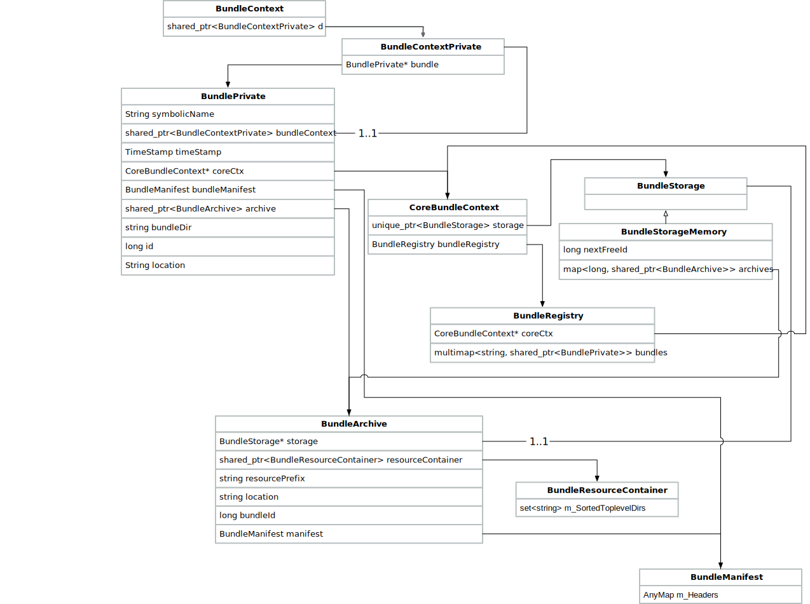
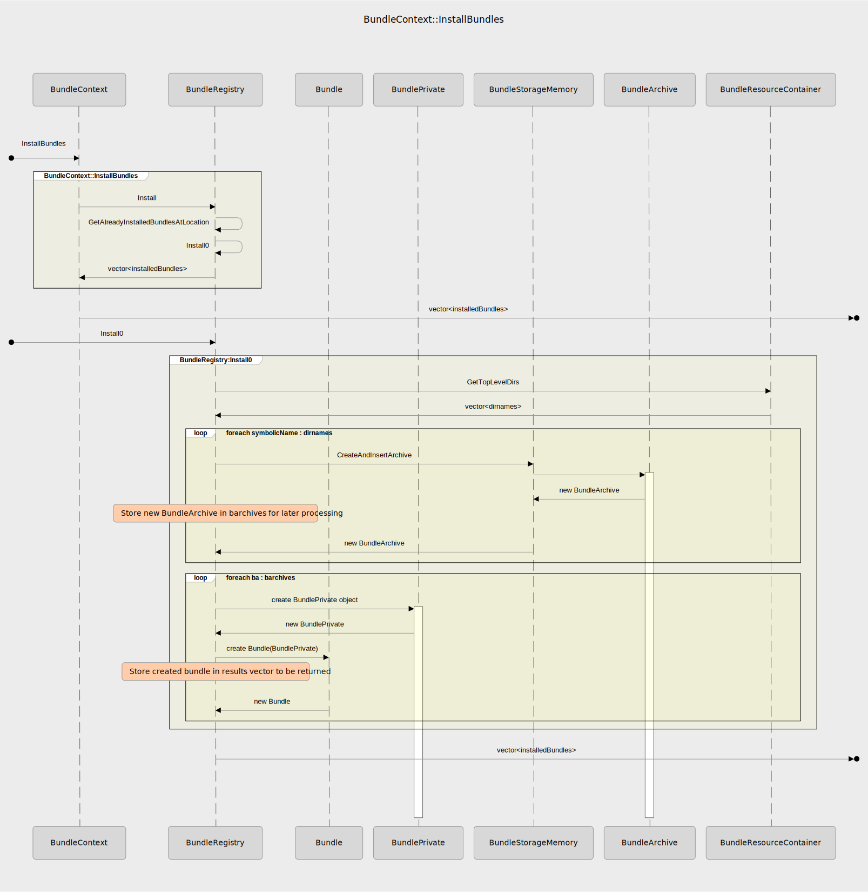

- Start Date: 2020-06-09
- RFC PR: (in a subsequent commit to the PR, fill me with the PR's URL)
- CppMicroServices Issue: (fill me with the URL of the CppMicroServices issue that necessisated this RFC, otherwise leave blank)

# Add BundleContext::InstallBundles API

## Summary

Provide a api to initialize the bundle registry with a bundle manifest

## Motivation

Allows users of the system to inject bundle manifests into the registry directly. We will be able to use this mechanism to speed up initial install of very large numbers of bundles.

## Detailed design

### Class Diagram

This is a partial class diagram showing the relationship between the pieces of the system used during the BundleContext::InstallBundles operation. Only those classes and fields that participate in that operation are shown.



### Sequence



### Classes

#### BundleContext

```c++
/** Wrapper around BundleRegistry::Install
* 
* @param location The absolute path to the location of the bundle whose manifest 
*        is to be installed
* @param manifest the manifest for the bundle. 
*/
vector<Bundle> BundleContext::InstallBundles(std::string location
                                             , std::vector<AnyMap> manifest);


```

* Modify old API to call new API with empty manifest map
* Wrapper around call to BundleRegistry::Install
* Refactor original API to call new API so we only have one implementation

#### BundleRegistry

```c++
/** Install the manifest for the bundle at location into the registry. 
* 
* The difference between this implementation and the existing implementation 
* that takes only the location argument is that in the original the manifest 
* is read from the bundle file rather than it being passed in as an argument.
* 
* @param location The absolute path to the location of the bundle whose manifest is to
*        be installed
* @manifest the manifest of the bundle at location
*/
vector<Bundle> BundleRegistry::Install(std::string location
                                       , std::vector<AnyMap> manifest);
```

* Update Install to accept a manifest to use for the installation instead of reading from bundle at location
* If manifest is and empty map, then proceed with install action as before. This accomplishes a lazy loading of the manifest from the file. The manifest is only read from the file in the event that it is empty when asked for.

#### BundleManifest

```c++
/** Initialize manifest with content of AnyMap
*
* Note: No validation is done on manifestHeaders. It is assumed that by
*       by this point, the headers are correct.
*
* @param manifestHeaders a map of the headers for a bundle manifest.
*/
explicit BundleManifest::BundleManifest(const AnyMap& manifestHeaders);

```

#### BundlePrivate

* Additional constructor that takes bundle manifest to be injected
* Modified to fetch bundle manifest from BundleArchive instead of parsing the resource
* Factor out manifest validation from constructor to allow for use from new constructor which takes a manifest to be injected as an argument

#### BundleStorage

The **BundleStorage** class hierarchy is used for implementing different strategies for tracking bundle **BundleArchives**. There are two subclasses, but only one of them provides an actual implementation. They are **BundleStorageMemory**, and **BundleStorageFile**. It also tracks which bundles are to be auto started.

```c++
  /**
   * Insert bundles from a container into persistent storagedata.
   *
   * This is a simpler version of the InstallBundles api that only deals with one bundle at a time.
   * 
   * @param resCont The container for the bundle data and resources.
   * @param topLevelEntries The top level entries in the container to be inserted as bundle archives.
   * @return A list of BundleArchive instances representing the installed bundles.
   */
  using ManifestT = cppmicroservices::AnyMap;
  virtual std::shared_ptr<BundleArchive> InsertArchive(const  std::shared_ptr<BundleResourceContainer>& resCont
                                                       , const std::string& topLevelEntry
                                                       , const ManifestT&) = 0;

```

* Combined BundleStorage::InsertBundleLib and BundleStorage::InsertArchives
  * InsertBundleLib was a wrapper around InsertArchives
    * It created a BundleResourceContainer for the location and called InsertArchives
    * Now the BundleResourceContainer is created if needed in BundleRegistry::GetAlreadyInstalldBundlesAtLocation and then passed in to BundleStorage::InsertArchive.

#### BundleArchive

* Refactor and remove Data class simplifying design.
* Add BundleManifest and constructor argument
  * Call BundleManifest::Parse from BundleArchive in the event that a manifest is not passed in at construction
* Add new **GetManifest()** method which does a lazy loadof the manifest from the archive if and only if we don't already have the manifest.

#### BundleResourceContainer

* Add **manifest** argument to constructor
  * If the **manifest** is not empty, use it to initialize the **m_SortedToplevelDirs**, and leave **m_IsContainerOpen** set to false
    * if **manifest** is empty, no manifest injection is happening, so open up the archive and read the manifest from there, set set **m_IsContainerOpen** to true.

#### BundleStorage(Memory)

**BundleStorage** is a base class from which 2 different implementations have been derived: BundleStorageMemory, and BundleStorageFile. Only BundleStorageMemory, has an actual implementation.

* Refactor
  * Remove **InsertArchives()** method and move loop to caller in **BundleRegistry::Install0**

#### Other Changes

* Various code cleanups (getting rid of "using std", exraneous cout output, etc.)

## Test Cases

- Install bundle manifest at a location, and then retrieve bundle and check manifest
- Install bundle manifest for a test bundle that exists. Then get the service, call a method through the service interface and made sure that it was successfully started.
- Install bundle manifest for multiple bundles that exist on disk and then start each one and verify that they have been properly instantiated.
- Ensure Install bundle manifest for bundle already installed is ignored
- Test for malformed manifest data.
  - I need to add manifest validation for required pieces of metadata for a bundle to work properly... we think that's only the bundle.symbolic_name.

## How we teach this

> What names and terminology work best for these concepts and why? How is this
> idea best presented? As a continuation of existing CppMicroServices patterns, or as a
> wholly new one?

> Would the acceptance of this proposal mean the CppMicroServices guides must be
> re-organized or altered? Does it change how CppMicroServices is taught to new users
> at any level?

> How should this feature be introduced and taught to existing CppMicroServices
> users?

## Drawbacks

> Why should we *not* do this? Please consider the impact on teaching CppMicroServices,
> on the integration of this feature with other existing and planned features,
> on the impact of the API churn on existing apps, etc.

> There are tradeoffs to choosing any path, please attempt to identify them here.

## Alternatives

> What other designs have been considered? What is the impact of not doing this?

> This section could also include prior art, that is, how other frameworks in the same domain have solved this problem.

## Unresolved questions

> Optional, but suggested for first drafts. What parts of the design are still
> TBD?