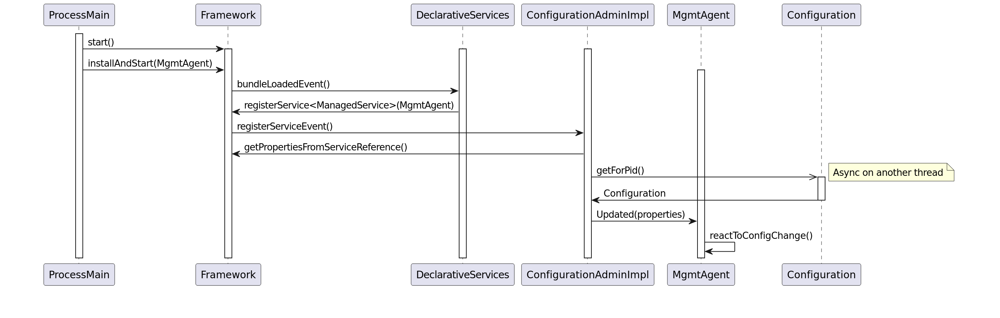
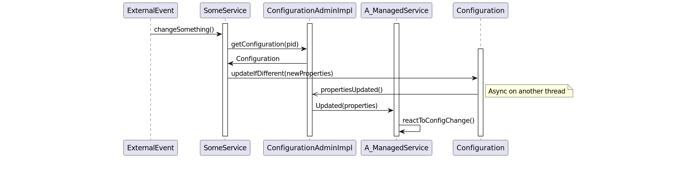

- Start Date: 2020-03-11
- RFC PR: https://github.com/CppMicroServices/CppMicroServices/commit/d51dc990a98dba5d7537f8afbe3d5cf29e60baeb

# Configuration Admin

## Summary

The Configuration Admin Service allows for the following:

**Dynamic Configuration**: It allows for the dynamic configuration of services. Services can be configured, reconfigured, or even deconfigured at runtime without the need to restart the application. This is particularly useful for applications that require high availability and cannot afford downtime for configuration changes.

**Service Properties Management**: The Configuration Admin manages and distributes configuration properties to services. These properties can be updated dynamically, and services can react to these updates to change their behavior accordingly.

**Decoupling Configuration and Services**: By separating the configuration management from the service logic, the Configuration Admin service allows for a cleaner, more modular architecture. Services do not need to know where their configuration data comes from, enhancing modularity and reusability.

## Motivation

Various CppMicroServices require external configuration. Currently the only way for them to do this is to either expose configuration methods through their public API, or have them depend on custom configuration interfaces, which they then use to obtain externally provided configurations. Neither of these options is particularly appealing. Fortunately, the OSGi specification proposes a solution; Configuration Admin (spec, API).


## Detailed design
### Functional Design
### Overview
The design presented here comprises four main components:
- The Configuration Admin interface, based heavily on the OSGi specification of the same name.
- The Configuration Admin implementation, which will implement that interface and be available as part of the compendium_services.
- The ManagedService and ManagedServiceFactory interfaces, also based heavily on the OSGi specifications (ManagedService, ManagedServiceFactory) of the same name.

**ConfigurationAdmin.hpp**
```c++
namespace cppmicroservices { namespace service { namespace cm {
 
    class ConfigurationAdmin {
      public:
        /**
         * Get an existing or new Configuration object. If the Configuration object for this PID does not exist,
         * create a new Configuration object for that PID, where properties are empty.
         */
        virtual std::shared_ptr<Configuration> GetConfiguration(std::string const& pid) = 0;
 
        /**
         * Create a new Configuration object for a ManagedServiceFactory. The factoryPid is the PID of the
         * ManagedServiceFactory (which must be different from the PIDs of any services it manages) and the
         * instanceName will be a new randomly-generated, unique name. The Configuration object's properties are empty.
         */
        virtual std::shared_ptr<Configuration> CreateFactoryConfiguration(std::string const& factoryPid) = 0;
 
        /**
         * Get an existing or new Configuration object for a ManagedServiceFactory. The factoryPid is the PID of the
         * ManagedServiceFactory (which must be different from the PIDs of any services it manages) and the
         * instanceName is the unique name of one of those managed services. If the Configuration object for this
         * combination of factoryPid and instanceName does not exist, create a new Configuration object for that
         * combination, where properties are empty.
         */
        virtual std::shared_ptr<Configuration> GetFactoryConfiguration(std::string const& factoryPid, std::string const& instanceName) = 0;
 
        /**
         * Used to list all of the available configurations. An LDAP filter expression can be used to filter based on any
         * property of the configuration, including service.pid and service.factoryPid
         *
         * NOT IMPLEMENTED - Will throw std::invalid_argument until this is implemented!
         */
        virtual std::vector<std::shared_ptr<Configuration>> ListConfigurations(std::string const& filter = {}) = 0;
 
      public:
        virtual ~ConfigurationAdmin() noexcept = default;
    };
 
} // namespace cm
} // namespace service
} // namespace cppmicroservices
```

**Configuration.hpp**
```c++
namespace cppmicroservices { namespace service { namespace cm {
 
    class Configuration {
      public:
        /**
         * Get the PID of this configuration.
         *
         * @throws std::runtime_error if this Configuration object has been Removed
         */
        virtual std::string GetPid() const = 0;
 
        /**
         * Get the Factory PID which is responsible for this configuration. If this configuration
         * does not belong to any Factory, returns an empty string.
         *
         * @throws std::runtime_error if this Configuration object has been Removed
         */
        virtual std::string GetFactoryPid() const = 0;
 
        /**
         * Get the properties of this configuration. Returns a copy.
         *
         * @throws std::runtime_error if this Configuration object has been Removed
         */
        virtual AnyMap GetProperties() const = 0;
 
        /**
         * Update the properties of this configuration; will trigger the pushing of the updated properties
         * to any ManagedService / ManagedServiceFactory which has a matching PID.
         *
         * @throws std::runtime_error if this Configuration object has been Removed
         */
        virtual void Update(AnyMap properties = {}) = 0;
 
        /**
         * Update the properties of this configuration if they differ from the current properties; if they
         * are different, will trigger the pushing of the updated properties to any ManagedService /
         * ManagedServiceFactory which has a matching PID.
         *
         * @throws std::runtime_error if this Configuration object has been Removed
         */
        virtual bool UpdateIfDifferent(AnyMap properties = {}) = 0;
 
        /**
         * Remove this Configuration from ConfigurationAdmin. Any corresponding ManagedService will be updated
         * with an empty AnyMap. Any corresponding ManagedServiceFactory will have the Removed method invoked
         * with the corresponding PID.
         *
         * @throws std::runtime_error if this Configuration object has been Removed already
         */
        virtual void Remove() = 0;
 
      public:
        virtual ~Configuration() noexcept = default;
    };
 
} // namespace cm
} // namespace service
} // namespace cppmicroservices
```

**ManagedService.hpp**
```c++
namespace cppmicroservices { namespace service { namespace cm {
 
    class ManagedService {
      public:
 
        /**
         * Called whenever the Configuration for this service is updated or removed from ConfigurationAdmin,
         * and when the ManagedService is first registered with the Framework.
         *
         * Can throw a ConfigurationException if there's a problem with the properties. This exception will
         * be logged by the ConfigurationAdminImpl to aid the application author's investigation into the
         * incorrect configuration.
         *
         * Will be called asynchronously from the Service registration or an update to the Configuration.
         */
        virtual void Updated(AnyMap const& properties) = 0;
 
      public:
        virtual ~ManagedService() noexcept = default;
    };
 
} // namespace cm
} // namespace service
} // namespace cppmicroservices
```

**ManagedServiceFactory.hpp**
```c++
namespace cppmicroservices { namespace service { namespace cm {
 
    class ManagedServiceFactory {
      public:
 
        /**
         * Called whenever any Configuration for this service is updated with ConfigurationAdmin,
         * and (possibly multiple times) when the ManagedServiceFactory is first registered with the Framework.
         *
         * Can throw a ConfigurationException if there's a problem with the properties. This exception will be
         * logged by the ConfigurationAdminImpl to aid the application author's investigation into the incorrect
         * configuration.
         *
         * Will be called asynchronously from the Service registration or an update to the Configuration. It is the
         * responsibility of the implementation of this interface to ensure this method is threadsafe (i.e. can be
         * invoked multiple times concurrently, or concurrently with invocation of Removed).
         *
         * The ManagedServiceFactory should update the corresponding service instance with the properties provided,
         * and potentially update the properties of that service's registration with the Framework (if it is registered).
         *
         * If a corresponding service instance does not exist for this pid, the ManagedServiceFactory should create one
         * with the properties provided.
         */
        virtual void Updated(std::string const& pid, AnyMap const& properties) = 0;
 
        /**
         * Called whenever one of the Configurations for this service is removed from ConfigurationAdmin.
         *
         * Will be called asynchronously from the removal of the Configuration. It is the
         * responsibility of the implementation of this interface to ensure this method is threadsafe (i.e. can be
         * invoked multiple times concurrently, or concurrently with invocation of Updated).
         *
         * The ManagedServiceFactory should remove the corresponding service instance, and if it is registered with
         * the Framework, it should be unregistered.
         */
        virtual void Removed(std::string const &pid) = 0;
 
      public:
        virtual ~ManagedServiceFactory() noexcept = default;
    };
 
} // namespace cm
} // namespace service
} // namespace cppmicroservices
```

### Configuration JSON Specification
The implementation will include a default implementation of a Configurator for pushing configurations into ConfigurationAdmin. This will inspect the bundle properties of any bundle being loaded and look for a cm root element. The schema for this JSON differs from the OSGi specification of the schema as it attempts to provide something more akin to the scr schema from the CppMicroServices DeclarativeServices implementation instead.

**cm**

*cm* is the root element

<table>
<thead>
<tr class="header">
<th><p>Key</p></th>
<th><p>Value Type</p></th>
<th><p>Description</p></th>
<th><p>Mandatory</p></th>
<th><p>Default</p></th>
</tr>
</thead>
<tbody>
<tr class="odd">
<td><p>version</p></td>
<td><p>integer</p></td>
<td><p>Indicates the version of the ConfigurationAdmin metadata.<br />
<td>Yes</td>
<td><p>Developers should currently specify the value as 1. If this element is not specified, the metadata parser will fail to parse the service component description.</p></td>
</tr>
<tr class="even">
<td><p>configurations</p></td>
<td><p>array</p></td>
<td><p>An array containing configuration descriptions. See the configurations element specification below.<br />
<td>Yes</td>
<td><p>None. If this element is not specified, the metadata parser will fail to parse the service component description.</p></td>
</tr>
</table>

**configurations**

*configurations* is a list of service configuration descriptions. A bundle could have more than one configuration provided with it, so this element is of type array. The following are the elements of a JSON object representing the configuration:

<table>
<thead>
<tr class="header">
<th><p>Key</p></th>
<th><p>Value Type</p></th>
<th><p>Description</p></th>
<th><p>Mandatory</p></th>
<th><p>Default</p></th>
</tr>
</thead>
<tbody>
<tr class="odd">
<td><p>pid</p></td>
<td><p>string</p></td>
<td><p>The full name of the pid this configuration is for. If this is the configuration for a service instance of a ManagedServiceFactory, the pid should take the form {FactoryPid}~{instanceName}</p></td>
<td>Yes</td>
<td>None. If this element is not specified, the metadata parser will fail to parse this configuration.</td>
</tr>
<tr class="even">
<td><p>properties</p></td>
<td><p>map</p></td>
<td><p>A JSON object representing the properties to pass to the service. They will be parsed into an AnyMap, so the JSON needs to be valid for that parsing.</p></td>
<td>No</td>
<td><p>Empty map</p></td>
</tr>
</table>

### Example JSON
This is an example of a manifest.json which would conform to the Schema.

```json
{
  "cm": {
    "version": 1,
    "configurations": [
      {
        "pid": "test",
        "properties": {
          "exampleProperty": "exampleValue",
          "exampleBool": false,
          "exampleDict": {
            "exampleSubProperty": "exampleSubValue"
          }
        }         
      },
      {
        "pid": "testfactory~config1",
        "properties": {
          "exampleProperty": "exampleValue1",
          "exampleBool": false,
          "exampleDict": {
            "exampleSubProperty": "exampleSubValue1"
          }
        }         
      },
      {
        "pid": "testfactory~config2",
        "properties": {
          "exampleProperty": "exampleValue2",
          "exampleBool": false,
          "exampleDict": {
            "exampleSubProperty": "exampleSubValue2"
          }
        }         
      }
    ]
  }
}
```
### Non-Functional Requirements
- The configuration update which is pushed to the ManagedService / ManagedServiceFactory must be asynchronous. This would benefit from some form of Threadpool / Executor
- Secure Configurations will be achieved by leveraging signed data-only CppMicroServices bundles.
- An Efficient Implementation will be acheived by limiting the usage of ServiceTrackers and limiting the work the ServiceTrackers do on the thread that invokes them. Bundle listeners will also be limited and implemented with efficiency in mind.

### Architecturally Significant Design Case
#### ConfigurationAdmin providing a Configuration, it gets updated, and then ConfigurationAdmin has to push this to a ManagedService.
The ManagedService (in this example, MgmtAgent) will first receive properties when it is registered with the CppMicroServices Framework. This will be triggered by the ConfigurationAdminImpl registering a ServiceTracker for ManagedService and ManagedServiceFactory services. When these ServiceTrackers are triggered, the ConfigurationAdminImpl will (asynchronously on another thread) fetch the Configuration and pass it to the ManagedService / ManagedServiceFactory using the Updated method.

<html>



</html>

At some later point in the process, a change in the configuratoin is triggered, and this would be handled per the following sequence diagram:

<html>



</html>
