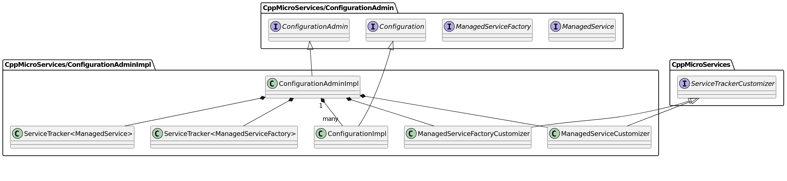
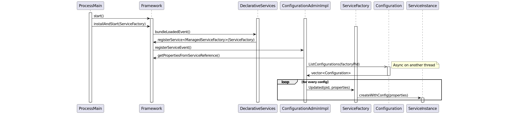

- Start Date: 2020-03-11
- RFC PR: https://github.com/CppMicroServices/CppMicroServices/commit/d51dc990a98dba5d7537f8afbe3d5cf29e60baeb

# Configuration Admin

## Summary

The Configuration Admin Service allows for the following:

**Dynamic Configuration**: It allows for the dynamic configuration of services. Services can be configured, reconfigured, or even deconfigured at runtime without the need to restart the application. This is particularly useful for applications that require high availability and cannot afford downtime for configuration changes.

**Service Properties Management**: The Configuration Admin manages and distributes configuration properties to services. These properties can be updated dynamically, and services can react to these updates to change their behavior accordingly.

**Decoupling Configuration and Services**: By separating the configuration management from the service logic, the Configuration Admin service allows for a cleaner, more modular architecture. Services do not need to know where their configuration data comes from, enhancing modularity and reusability.

## Motivation

Various CppMicroServices require external configuration. Currently the only way for them to do this is to either expose configuration methods through their public API, or have them depend on custom configuration interfaces, which they then use to obtain externally provided configurations. Neither of these options is particularly appealing. Fortunately, the OSGi specification proposes a solution; Configuration Admin (spec, API).


## Detailed design
### Functional Design
### Overview
The design presented here comprises four main components:
- The Configuration Admin interface, based heavily on the OSGi specification of the same name.
- The Configuration Admin implementation, which will implement that interface and be available as part of the compendium_services.
- The ManagedService and ManagedServiceFactory interfaces, also based heavily on the OSGi specifications (ManagedService, ManagedServiceFactory) of the same name.

**ConfigurationAdmin.hpp**
```c++
namespace cppmicroservices::service::cm
{

    /**
        \defgroup gr_configurationadmin ConfigurationAdmin
        \brief Groups ConfigurationAdmin class related symbols.
        */

    /**
        * \ingroup gr_configurationadmin
        * The ConfigurationAdmin interface is the means by which applications and services can
        * interract with the Configuration objects at runtime. It can be used to create or obtain
        * Configuration objects, which can in turn be queried for their properties or be used to
        * update the properties of a given service or service factory.
        */
    class ConfigurationAdmin
    {
        public:
        virtual ~ConfigurationAdmin() noexcept = default;

        /**
            * Get an existing or new Configuration object. If the Configuration object for this
            * PID does not exist, create a new Configuration object for that PID with empty
            * properties.
            *
            * @param pid The PID to get the Configuration for
            * @return the Configuration object for this PID
            */
        virtual std::shared_ptr<Configuration> GetConfiguration(std::string const& pid) = 0;

        /**
            * Create a new Configuration object for a ManagedServiceFactory. The factoryPid is the PID of the
            * ManagedServiceFactory (which must be different from the PIDs of any services it manages) and the
            * instanceName will be a randomly-generated, unique name. The Configuration object's properties
            * are empty. The returned Configuration will have a PID of the form $factoryPid~$instanceName.
            *
            * @param factoryPid The Factory PID to create a new Configuration for
            * @return a new Configuration object for this Factory PID with a randomly-generated unique name
            */
        virtual std::shared_ptr<Configuration> CreateFactoryConfiguration(std::string const& factoryPid) = 0;

        /**
            * Get an existing or new Configuration object for a ManagedServiceFactory. The factoryPid is the PID of
            * the ManagedServiceFactory (which must be different from the PIDs of any services it manages) and the
            * instanceName is the unique name of one of those managed services. If the Configuration object for
            * this combination of factoryPid and instanceName does not exist, create a new Configuration object for
            * that combination, where properties are empty. The returned Configuration will have a PID of the form
            * $factoryPid~$instanceName.
            *
            * @param factoryPid The Factory PID to use to get an existing Configuration or create a new
            * Configuration for
            * @param instanceName The unique name of an instance of a serivce managed by the ManagedServiceFactory
            * @return the Configuration object for this combination of Factory PID and instance name
            */
        virtual std::shared_ptr<Configuration> GetFactoryConfiguration(std::string const& factoryPid,
                                                                        std::string const& instanceName)
            = 0;

        /**
            * Used to list all of the available configurations. An LDAP filter expression can be used to filter
            * based on any property of the configuration, including service.pid and service.factoryPid
            *
            * @param filter An optional filter expression to limit the Configurations which are returned, or empty
            * for all.
            * @return a vector of Configurations matching the filter.
            */
        virtual std::vector<std::shared_ptr<Configuration>> ListConfigurations(std::string const& filter = {})
            = 0;
    };
} // namespace cppmicroservices::service::cm
```

**Configuration.hpp**
```c++
namespace cppmicroservices::service::cm
{

    /**
        \defgroup gr_configuration Configuration
        \brief Groups Configuration class related symbols.
        */

    /**
        * \ingroup gr_configuration
        *
        * The Configuration object (normally obtained as a std::shared_ptr<Configuration>)
        * is the principal means for clients of ConfigurationAdmin to inspect or update the
        * Configuration of a given service or service factory.
        */
    class Configuration
    {
        public:
        virtual ~Configuration() noexcept = default;

        /**
            * Get the PID of this Configuration.
            *
            * @throws std::runtime_error if this Configuration object has been Removed
            *
            * @return the PID of this Configuration
            */
        virtual std::string GetPid() const = 0;

        /**
            * Get the Factory PID which is responsible for this Configuration. If this
            * Configuration does not belong to any Factory, returns an empty string.
            *
            * @throws std::runtime_error if this Configuration object has been Removed
            *
            * @return the Factory PID associated with this Configuration, if applicable
            */
        virtual std::string GetFactoryPid() const = 0;

        /**
            * Get the properties of this Configuration. Returns a copy.
            *
            * @throws std::runtime_error if this Configuration object has been Removed
            *
            * @return the properties of this Configuration
            */
        virtual AnyMap GetProperties() const = 0;

        /**
            * Get the change count. Each Configuration must maintain a change counter that
            * is incremented with a positive value every time the configuration is updated
            * and its properties are stored. The counter must be incremented before the targets
            * are updated and events are sent out.
            *
            * @throws std::runtime_error if this Configuration object has been Removed
            *
            * @return A monotonically increasing value reflecting changes in this Configuration.
            */
        virtual unsigned long GetChangeCount() const = 0;

        /**
            * Update the properties of this Configuration. Invoking this method will trigger the
            * ConfigurationAdmin impl to push the updated properties to any ManagedService /
            * ManagedServiceFactory / ConfigurationListener which has a matching PID / Factory PID.
            *
            * If the properties are empty, the Configuration will not be removed, but instead
            * updated with an empty properties map.
            *
            * @throws std::runtime_error if this Configuration object has been Removed
            *
            * @param properties The properties to update this Configuration with.
            *
            * @remarks The shared_future<void> returned can contain a cppmicroservices::SecurityException
            *  if the Configuration caused a bundle's shared library to be loaded and the bundle failed
            *  a security check.
            *
            * @return a shared_future<void> which can be used to wait for the asynchronous
            * operation that pushed the update to a ManagedService, ManagedServiceFactory or
            * ConfigurationListener to complete. If an exception occurs during the execution
            * of the service component's Modified method, this exception is intercepted and
            * logged by Declarative Services. This exception is not returned in the shared_future.
            */
        virtual std::shared_future<void> Update(AnyMap properties
                                                = AnyMap { AnyMap::UNORDERED_MAP_CASEINSENSITIVE_KEYS })
            = 0;

        /**
            * Update the properties of this Configuration if they differ from the current properties.
            * Invoking this method will trigger the ConfigurationAdmin impl to push the updated
            * properties to any ManagedService / ManagedServiceFactory / ConfigurationListener which has a matching
            * PID / Factory PID, but only if the properties differ from the current properties. It will return true
            * in this case, and false otherwise.
            *
            * If the properties are empty, the Configuration will not be removed, but instead
            * updated with an empty properties map, unless it already had empty properties.
            *
            * @throws std::runtime_error if this Configuration object has been Removed
            *
            * @param properties The properties to update this Configuration with (if they differ)
            *
            * @remarks The shared_future<void> returned can contain a cppmicroservices::SecurityException
            *  if the Configuration caused a bundle's shared library to be loaded and the bundle failed
            *  a security check.
            *
            * @return std::pair<boolean, std::shared_future<void>> The boolean indicates whether
            * the properties were updated or not. The shared_future<void> allows access to the result of the
            * asynchronous operation that pushed the update operation to a ManagedService, ManagedServiceFactory or
            * ConfigurationListener. If an exception occurs during the execution
            * of the service component's Modified method, this exception is intercepted and
            * logged by Declarative Services. This exception is not returned in the shared_future.
            */
        virtual std::pair<bool, std::shared_future<void>> UpdateIfDifferent(
            AnyMap properties = AnyMap { AnyMap::UNORDERED_MAP_CASEINSENSITIVE_KEYS })
            = 0;

        /**
            * Remove this Configuration from ConfigurationAdmin. This will trigger a push to any
            * ConfigurationListener. This will also trigger the ConfigurationAdmin
            * implementation to update any corresponding ManagedService with an empty AnyMap. Any
            * corresponding ManagedServiceFactory will have its Removed method invoked with the
            * corresponding PID.
            *
            * @throws std::runtime_error if this Configuration object has been Removed already
            *
            * @return a shared_future<void> to access the result of the asynchronous operation
            * that pushed the remove operation to a ManagedService, ManagedServiceFactory or
            * ConfigurationListener. If an exception occurs during the execution
            * of the service component's Modified method, this exception is intercepted and
            * logged by Declarative Services. This exception is not returned in the shared_future.
            */
        virtual std::shared_future<void> Remove() = 0;
    };
} // namespace cppmicroservices::service::cm
```

**ManagedService.hpp**
```c++
namespace cppmicroservices::service::cm
{

    /**
        \defgroup gr_managedservice ManagedService
        \brief Groups ManagedService class related symbols.
        */

    /**
        * \ingroup gr_managedservice
        *
        * The ManagedService interface is the interface that services should implement
        * to receive updates from the ConfigurationAdmin implementation with their
        * Configuration. The Configuration will be provided based on the service.pid
        * ServiceProperty of the Service being registered with the CppMicroServices
        * Framework. If this isn't provided, the component.name property injected by
        * DeclarativeServices will be used instead. If no Configuration is available
        * for either of these, an empty AnyMap will be used to call Updated. Per the
        * OSGi Spec, ManagedService is intended to be used for services which have
        * singleton scope, where there will only be one implementation of a given
        * interface.
        */
    class ManagedService
    {
        public:
        virtual ~ManagedService() noexcept = default;

        /**
            * Called whenever the Configuration for this service is updated or removed from ConfigurationAdmin,
            * and when the ManagedService is first registered with the Framework, to provide the initial
            * Configuration.
            *
            * Can throw a ConfigurationException if there's a problem with the properties. This exception will
            * be logged by the ConfigurationAdminImpl to aid the application author's investigation into the
            * incorrect configuration.
            *
            * Will be called asynchronously from the Service's registration or an update to the Configuration.
            *
            * @throws ConfigurationException if something is wrong with the properties provided.
            *
            * @param properties The properties from the new/initial Configuration for this ManagedService
            */
        virtual void Updated(AnyMap const& properties) = 0;
    };
} // namespace cppmicroservices::service::cm
```

**ManagedServiceFactory.hpp**
```c++
namespace cppmicroservices::service::cm
{

    /**
        \defgroup gr_managedservicefactory ManagedServiceFactory
        \brief Groups ManagedServiceFactory class related symbols.
        */
    /**
        * \ingroup gr_managedservicefactory
        *
        * The ManagedServiceFactory interface is the interface that service factories
        * should implement to receive updates from the ConfigurationAdmin implementation
        * with the Configurations for the services that the Factory will provide. The
        * service.pid ServiceProperty of the ManagedServiceFactory (or the
        * component.name which is injected by DeclarativeServices if no service.pid
        * is provided) will be used to select all Configurations applicable to this factory.
        * Per the OSGi Spec, the ManagedServiceFactory is intended to be used when multiple
        * instances of a given Service will exist in the Framework, but each with different
        * Configurations. For this reason, ManagedServiceFactory implementations are encouraged
        * to mirror any properties (excluding security critical properties) into the
        * ServiceProperty map when publishing the service with the Framework (if it is going to
        * be published). Clients of the service can then filter on the properties they require.
        *
        * <p>
        * The Updated method will be invoked once for each initial Configuration for this
        * factory and then again whenever any of those Configurations change or whenever any
        * new Configurations for this factory are added.</p>
        *
        * <p>
        * The Removed method will be invoked whenever any Configuration which this factory
        * has previously been configured with is removed from the ConfigurationAdmin implementation.</p>
        */
    class ManagedServiceFactory
    {
        public:
        virtual ~ManagedServiceFactory() noexcept = default;

        /**
            * Called whenever any Configuration for this service factory is updated with ConfigurationAdmin,
            * and (possibly multiple times) when the ManagedServiceFactory is first registered with the Framework.
            *
            * Can throw a ConfigurationException if there's a problem with the properties. This exception will be
            * logged by the ConfigurationAdminImpl to aid the application author's investigation into the incorrect
            * configuration.
            *
            * Will be called asynchronously from the Service registration or an update to the Configuration.
            *
            * The ManagedServiceFactory should update the corresponding service instance with the properties
            * provided, and potentially update the properties of that service's registration with the Framework (if
            * it is registered).
            *
            * If a corresponding service instance does not exist for this pid, the ManagedServiceFactory should
            * create one with the properties provided. It should also register that new service with the Framework,
            * if applicable.
            *
            * @throws ConfigurationException if something is wrong with the properties provided.
            *
            * @param pid The unique pid for this Configuration, of the form "$FACTORY_PID~$INSTANCE_NAME"
            * @param properties The properties for this Configuration
            */
        virtual void Updated(std::string const& pid, AnyMap const& properties) = 0;

        /**
            * Called whenever one of the Configurations for this service is removed from ConfigurationAdmin.
            *
            * Will be called asynchronously from the removal of the Configuration.
            *
            * The ManagedServiceFactory should remove the corresponding service instance, and if it is registered
            * with the Framework, it should be unregistered.
            *
            * @param pid The unique pid for the Configuration to remove, of the form "$FACTORY_PID~$INSTANCE_NAME"
            */
        virtual void Removed(std::string const& pid) = 0;
    };
} // namespace cppmicroservices::service::cm
```

### Configuration JSON Specification
The implementation will include a default implementation of a Configurator for pushing configurations into ConfigurationAdmin. This will inspect the bundle properties of any bundle being loaded and look for a cm root element. The schema for this JSON differs from the OSGi specification of the schema as it attempts to provide something more akin to the scr schema from the CppMicroServices DeclarativeServices implementation instead.

**cm**

*cm* is the root element

<table>
<thead>
<tr class="header">
<th><p>Key</p></th>
<th><p>Value Type</p></th>
<th><p>Description</p></th>
<th><p>Mandatory</p></th>
<th><p>Default</p></th>
</tr>
</thead>
<tbody>
<tr class="odd">
<td><p>version</p></td>
<td><p>integer</p></td>
<td><p>Indicates the version of the ConfigurationAdmin metadata.<br />
<td>Yes</td>
<td><p>Developers should currently specify the value as 1. If this element is not specified, the metadata parser will fail to parse the service component description.</p></td>
</tr>
<tr class="even">
<td><p>configurations</p></td>
<td><p>array</p></td>
<td><p>An array containing configuration descriptions. See the configurations element specification below.<br />
<td>Yes</td>
<td><p>None. If this element is not specified, the metadata parser will fail to parse the service component description.</p></td>
</tr>
</table>

**configurations**

*configurations* is a list of service configuration descriptions. A bundle could have more than one configuration provided with it, so this element is of type array. The following are the elements of a JSON object representing the configuration:

<table>
<thead>
<tr class="header">
<th><p>Key</p></th>
<th><p>Value Type</p></th>
<th><p>Description</p></th>
<th><p>Mandatory</p></th>
<th><p>Default</p></th>
</tr>
</thead>
<tbody>
<tr class="odd">
<td><p>pid</p></td>
<td><p>string</p></td>
<td><p>The full name of the pid this configuration is for. If this is the configuration for a service instance of a ManagedServiceFactory, the pid should take the form {FactoryPid}~{instanceName}</p></td>
<td>Yes</td>
<td>None. If this element is not specified, the metadata parser will fail to parse this configuration.</td>
</tr>
<tr class="even">
<td><p>properties</p></td>
<td><p>map</p></td>
<td><p>A JSON object representing the properties to pass to the service. They will be parsed into an AnyMap, so the JSON needs to be valid for that parsing.</p></td>
<td>No</td>
<td><p>Empty map</p></td>
</tr>
</table>

### Example JSON
This is an example of a manifest.json which would conform to the Schema.

```json
{
  "cm": {
    "version": 1,
    "configurations": [
      {
        "pid": "test",
        "properties": {
          "exampleProperty": "exampleValue",
          "exampleBool": false,
          "exampleDict": {
            "exampleSubProperty": "exampleSubValue"
          }
        }         
      },
      {
        "pid": "testfactory~config1",
        "properties": {
          "exampleProperty": "exampleValue1",
          "exampleBool": false,
          "exampleDict": {
            "exampleSubProperty": "exampleSubValue1"
          }
        }         
      },
      {
        "pid": "testfactory~config2",
        "properties": {
          "exampleProperty": "exampleValue2",
          "exampleBool": false,
          "exampleDict": {
            "exampleSubProperty": "exampleSubValue2"
          }
        }         
      }
    ]
  }
}
```
### Non-Functional Requirements
- The configuration update which is pushed to the ManagedService / ManagedServiceFactory must be asynchronous. This would benefit from some form of Threadpool / Executor
- Secure Configurations will be achieved by leveraging signed data-only CppMicroServices bundles.
- An Efficient Implementation will be acheived by limiting the usage of ServiceTrackers and limiting the work the ServiceTrackers do on the thread that invokes them. Bundle listeners will also be limited and implemented with efficiency in mind.

### Architecturally Significant Design Case
#### ConfigurationAdmin providing a Configuration, it gets updated, and then ConfigurationAdmin has to push this to a ManagedService.
The ManagedService (in this example, MgmtAgent) will first receive properties when it is registered with the CppMicroServices Framework. This will be triggered by the ConfigurationAdminImpl registering a ServiceTracker for ManagedService and ManagedServiceFactory services. When these ServiceTrackers are triggered, the ConfigurationAdminImpl will (asynchronously on another thread) fetch the Configuration and pass it to the ManagedService / ManagedServiceFactory using the Updated method.

<html>


</html>

At some later point in the process, a change in the configuratoin is triggered, and this would be handled per the following sequence diagram:

<html>


</html>

## Component/Module Design
### Roles and Responsibilities

- **ConfigurationAdmin**: Provide the interfaces for other components to depend on and implement/utilise.
- **ConfigurationAdminImpl**: Provide the implementation of the ConfigurationAdmin interface, and a default Configurator.

## Domain Model - Class Diagram
<html>



</html>

## Interaction Diagram

In addition to the ManagedService diagram in the Architecturally Significant Design Case, the ManagedServiceFactory case is also important, but startup is very similar:

<html>



</html>
