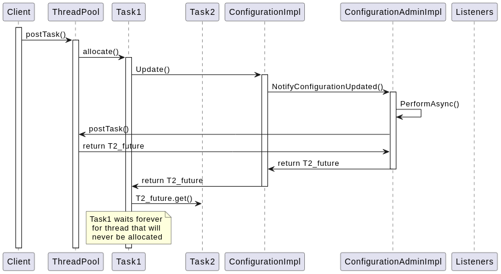
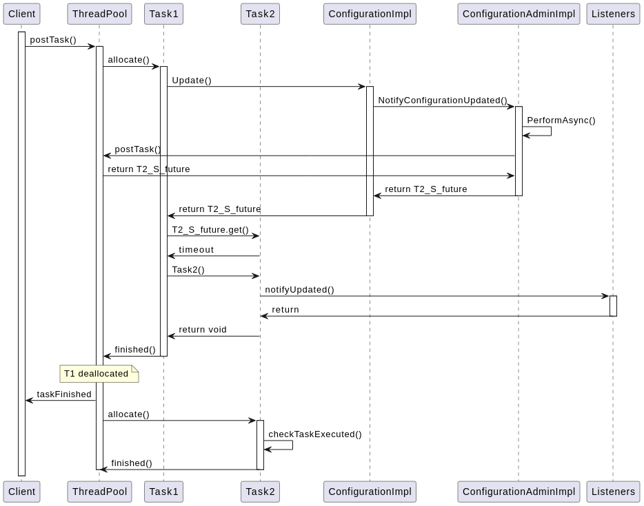

- Start Date: 2024-07-01
- RFC PR: https://github.com/CppMicroServices/CppMicroServices/commit/24

# Safe Futures

## Summary

The ThreadpoolSafeFuture object allows for the following:

**ThreadpoolSafeFuture for Configuration Updates**: The new `ThreadpoolSafeFuture` feature is returned from calls to update configurations. This allows callers, who are allocated in threads that are allocated on the AsyncWorkService, to wait on configuration updates without risking deadlocks in the threadpool.

## Motivation
Various CppMicroServices require external configuration. These configurations are created using the ConfigAdmin service, and calls to `Update`, `UpdateIfDifferent`, and `Remove`. However, currently if those calls are made from a thread allocated on the AsyncWorkService, there is a possibility of overwhelming that threadpool and deadlocking. 

The introduction of the `ThreadpoolSafeFuture` feature enhances this solution by providing a safe and efficient way to handle asynchronous configuration updates. This ensures that services can wait for updates without risking deadlocks, thereby improving the robustness and reliability of the configuration management process.

## Detailed design
### Functional Design

Rather than returning a raw future to the user that they use to directly access the configuration update task, we wrap it with logic that checks for suspected deadlocks and resolves them if present.

**ThreadpoolSafeFuture.h**
```c++
/*=============================================================================
  Library: CppMicroServices
Copyright Kevlin Henney, 2000, 2001, 2002. All rights reserved.
Extracted from Boost 1.46.1 and adapted for CppMicroServices.
Permission is hereby granted, free of charge, to any person or organization
obtaining a copy of the software and accompanying documentation covered by
this license (the "Software") to use, reproduce, display, distribute,
execute, and transmit the Software, and to prepare derivative works of the
Software, and to permit third-parties to whom the Software is furnished to
do so, all subject to the following:
The copyright notices in the Software and this entire statement, including
the above license grant, this restriction and the following disclaimer,
must be included in all copies of the Software, in whole or in part, and
all derivative works of the Software, unless such copies or derivative
works are solely in the form of machine-executable object code generated by
a source language processor.
THE SOFTWARE IS PROVIDED "AS IS", WITHOUT WARRANTY OF ANY KIND, EXPRESS OR
IMPLIED, INCLUDING BUT NOT LIMITED TO THE WARRANTIES OF MERCHANTABILITY,
FITNESS FOR A PARTICULAR PURPOSE, TITLE AND NON-INFRINGEMENT. IN NO EVENT
SHALL THE COPYRIGHT HOLDERS OR ANYONE DISTRIBUTING THE SOFTWARE BE LIABLE
FOR ANY DAMAGES OR OTHER LIABILITY, WHETHER IN CONTRACT, TORT OR OTHERWISE,
ARISING FROM, OUT OF OR IN CONNECTION WITH THE SOFTWARE OR THE USE OR OTHER
DEALINGS IN THE SOFTWARE.
=========================================================================*/

#ifndef CPPMICROSERVICES_THREADPOOLSAFEFUTURE_H
#define CPPMICROSERVICES_THREADPOOLSAFEFUTURE_H

#include <future>
#include <vector>
#include "cppmicroservices/FrameworkExport.h"


namespace cppmicroservices
{
    using ActualTask = std::packaged_task<void(bool)>;
    using PostTask = std::packaged_task<void()>;
    class US_Framework_EXPORT ThreadpoolSafeFuture
    {
      public:
        ThreadpoolSafeFuture(ThreadpoolSafeFuture const& other) = default;
        ThreadpoolSafeFuture& operator=(ThreadpoolSafeFuture const& other) = default;
        ThreadpoolSafeFuture(ThreadpoolSafeFuture&& other) noexcept;
        ThreadpoolSafeFuture& operator=(ThreadpoolSafeFuture&& other) noexcept = default;

        /** 
         * Constructs an invalid %ThreadpoolSafeFuture object.
         *
         * Valid ThreadpoolSafeFuture objects can only be created by the framework in
         *
         * @see operator bool() const
         */
        virtual ~ThreadpoolSafeFuture() = default;

        /**
         * Compares this \c ThreadpoolSafeFuture object with the specified ThreadpoolSafeFuture.
         *
         * Valid \c ThreadpoolSafeFuture objects compare equal if and only if they
         * are installed in the same framework instance and their
         * ThreadpoolSafeFuturePrivate is equal. Invalid \c ThreadpoolSafeFuture objects are always
         * considered to be equal.
         *
         * @param rhs The \c ThreadpoolSafeFuture object to compare this object with.
         * @return \c true if this \c ThreadpoolSafeFuture object is equal to \c rhs,
         *         \c false otherwise.
         */
        bool operator==(ThreadpoolSafeFuture const& rhs) const;

        /**
         * Compares this \c ThreadpoolSafeFuture object with the specified ThreadpoolSafeFuture
         * for inequality.
         *
         * @param rhs The \c ThreadpoolSafeFuture object to compare this object with.
         * @return Returns the result of <code>!(*this == rhs)</code>.
         */
        bool operator!=(ThreadpoolSafeFuture const& rhs) const;

        bool operator<(ThreadpoolSafeFuture const& rhs) const = delete;

        /**
         * Tests this %ThreadpoolSafeFuture object for validity.
         *
         * Invalid \c ThreadpoolSafeFuture objects are created by the default constructor.
         *
         * @return \c true if this %ThreadpoolSafeFuture object is valid and can safely be used,
         *         \c false otherwise.
         */
        explicit operator bool() const;

        /**
         * Releases any resources held or locked by this
         * \c ThreadpoolSafeFuture and renders it invalid.
         */
        ThreadpoolSafeFuture& operator=(std::nullptr_t);

        // Method to get the result
        void get() const;
        void wait() const;
        template <class Rep, class Period>
        std::future_status wait_for(std::chrono::duration<Rep, Period> const& timeout_duration) const;

      protected:
        ThreadpoolSafeFuture() = default;
    };
} // namespace cppmicroservices

#endif // CPPMICROSERVICES_THREADPOOLSAFEFUTURE_H
```

**ThreadpoolSafeFuturePrivate.hpp**
```c++
namespace cppmicroservices::cmimpl
{
    using ActualTask = std::packaged_task<void(bool)>;
    using PostTask = std::packaged_task<void()>;
    class ThreadpoolSafeFuturePrivate
        : public cppmicroservices::ThreadpoolSafeFuture
    {
      public:
        ThreadpoolSafeFuturePrivate(std::shared_future<void> future,
                                    std::shared_ptr<std::atomic<bool>> asyncStarted = nullptr,
                                    std::shared_ptr<ActualTask> task = nullptr);
        ThreadpoolSafeFuturePrivate() = default;

        // Destructor
        ~ThreadpoolSafeFuturePrivate() = default;

        ThreadpoolSafeFuturePrivate(ThreadpoolSafeFuturePrivate const& other) = delete;
        ThreadpoolSafeFuturePrivate& operator=(ThreadpoolSafeFuturePrivate const& other) = delete;
        ThreadpoolSafeFuturePrivate(ThreadpoolSafeFuturePrivate&& other) noexcept = default;
        ThreadpoolSafeFuturePrivate& operator=(ThreadpoolSafeFuturePrivate&& other) noexcept = default;

        // Method to get the result
        void get() const;
        void wait() const;
        template <class Rep, class Period>
        std::future_status
        wait_for(std::chrono::duration<Rep, Period> const& timeout_duration) const
        {
            return future.wait_for(timeout_duration);
        }

        std::shared_future<void>
        retrieveFuture()
        {
            return future;
        }

      private:
        std::shared_future<void> future;
        std::shared_ptr<std::atomic<bool>> asyncStarted;
        std::shared_ptr<ActualTask> task;
    };
} // namespace cppmicroservices::cmimpl
```

**Changes to ConfigurationImpl.hpp**
```c++
namespace cppmicroservices::cmimpl
    {
    /**
        * Update the properties of this Configuration.
        *
        * @return a std::shared_future<void>
        * @note not safe to wait on future from within the AsyncWorkService
        *
        * See {@code Configuration#Update}
        */
    std::shared_future<void> Update(AnyMap properties) override;

    /**
        * Update the properties of this Configuration and return
        *
        * @return A std::shared_ptr<ThreadpoolSafeFuture>, safe to wait on from within the
        * AsyncWorkService used by the Framework
        *
        * See {@code Configuration#Update}
        */
    std::shared_ptr<ThreadpoolSafeFuture> SafeUpdate(AnyMap newProperties) override;
    std::shared_ptr<ThreadpoolSafeFuturePrivate> SafeUpdateImpl(AnyMap newProperties);

    /**
        * Update the properties of this Configuration if they differ from the current properties.
        *
        * @return a std::shared_future<void> and whether the config was updated
        * @note not safe to wait on future from within the AsyncWorkService
        *
        * See {@code Configuration#UpdateIfDifferent}
        */
    std::pair<bool, std::shared_future<void>> UpdateIfDifferent(AnyMap properties) override;

    /**
        * Update the properties of this Configuration if they differ from the current properties.
        *
        * @return A pair<bool, std::shared_ptr<ThreadpoolSafeFuture>>, safe to wait on from within the
        * AsyncWorkService used by the Framework
        *
        * See {@code Configuration#UpdateIfDifferent}
        */
    std::pair<bool, std::shared_ptr<ThreadpoolSafeFuture>> SafeUpdateIfDifferent(AnyMap properties) override;
    std::pair<bool, std::shared_ptr<ThreadpoolSafeFuturePrivate>> SafeUpdateIfDifferentImpl(AnyMap properties);

    /**
        * Remove this Configuration from ConfigurationAdmin.
        *
        * @return A std::shared_future<void>,
        * @note not safe to wait on future from within the AsyncWorkService
        *
        * See {@code Configuration#Remove}
        */
    std::shared_future<void> Remove() override;

    /**
        * Remove this Configuration from ConfigurationAdmin.
        *
        * @return A std::shared_ptr<ThreadpoolSafeFuture>, safe to wait on from within the
        * AsyncWorkService used by the Framework
        *
        * See {@code Configuration#Remove}
        */
    std::shared_ptr<ThreadpoolSafeFuture> SafeRemove() override;
    std::shared_ptr<ThreadpoolSafeFuturePrivate> SafeRemoveImpl();
    }
```

**Changes to ConfigurationAdminPrivate.hpp**
```c++
    /**
        * Internal method used to notify any {@code ManagedService} or {@code ManagedServiceFactory} of an
        * update to a {@code Configuration}. Performs the notifications asynchronously with the latest state
        * of the properties at the time.
        *
        * @param pid The PID of the {@code Configuration} which has been updated
        */
    virtual std::shared_ptr<ThreadpoolSafeFuturePrivate> NotifyConfigurationUpdated(
        std::string const& pid,
        unsigned long const changeCount)
        = 0;

    /**
        * Internal method used by {@code ConfigurationImpl} to notify any {@code ManagedService} or
        * {@code ManagedServiceFactory} of the removal of a {@code Configuration}. Performs the notifications
        * asynchronously.
        *
        * @param pid The PID of the {@code Configuration} which has been removed.
        * @param configurationId The unique id of the configuration which has been removed. Used to avoid race
        * conditions.
        */
    virtual std::shared_ptr<ThreadpoolSafeFuturePrivate> NotifyConfigurationRemoved(
        std::string const& pid,
        std::uintptr_t configurationId,
        unsigned long changeCount)
        = 0;
```

**Changes to ConfigurationAdminImpl.hpp**
```c++
    /**
        * Internal method used to notify any {@code ManagedService} or {@code ManagedServiceFactory} or
        * {@code ConfigurationListener} of an update to a {@code Configuration}. Performs the
        * notifications asynchronously with the latest state of the properties at the time.
        *
        * See {@code ConfigurationAdminPrivate#NotifyConfigurationUpdated}
        */
    std::shared_ptr<ThreadpoolSafeFuturePrivate> NotifyConfigurationUpdated(
        std::string const& pid,
        unsigned long const changeCount) override;

    /**
        * Internal method used by {@code ConfigurationImpl} to notify any {@code ManagedService} or
        * {@code ManagedServiceFactory} of the removal of a {@code Configuration}. Performs the notifications
        * asynchronously.
        *
        * See {@code ConfigurationAdminPrivate#NotifyConfigurationRemoved}
        */
    std::shared_ptr<ThreadpoolSafeFuturePrivate> NotifyConfigurationRemoved(std::string const& pid,
                                                    std::uintptr_t configurationId,
                                                    unsigned long changeCount) override;

```

**Changes to Configuration.hpp**
```c++
        /**
            * Same as Update() except:
            * @return a std::shared_ptr<ThreadpoolSafeFuture> that is safe to wait on from within a thread allocated to the AsyncWorkService
            */
        virtual std::shared_ptr<ThreadpoolSafeFuture> SafeUpdate(
            AnyMap properties = AnyMap { AnyMap::UNORDERED_MAP_CASEINSENSITIVE_KEYS })
            = 0;


        /**
            * Same as UpdateIfDifferent() except:
            * @return a std::shared_ptr<ThreadpoolSafeFuture> that is safe to wait on from within a thread allocated to the AsyncWorkService
            */
        virtual std::pair<bool, std::shared_ptr<ThreadpoolSafeFuture>> SafeUpdateIfDifferent(
            AnyMap properties = AnyMap { AnyMap::UNORDERED_MAP_CASEINSENSITIVE_KEYS })
            = 0;

        /**
            * Same as Remove() except:
            * @return a std::shared_ptr<ThreadpoolSafeFuture> that is safe to wait on from within a thread allocated to the AsyncWorkService
            */
        virtual std::shared_ptr<ThreadpoolSafeFuture> SafeRemove() = 0;
```

### Non-Functional Requirements
- Support asynchronous configuration updates with either method, `Update`, `UpdateIfDifferent`, and `Remove` or the `Safe` version of each.
` Support threadsafe synchronous waiting when using a discrete threadpool for the above 3 operations

### Architecturally Significant Design Case
#### User thread, allocated on a AsyncWorkService thread, calls Update on a configuration
From a thread allocated to the Threadpool, a client will call `Update()` on a configuration. This update will be posted to the threadpool. In the simplest case of a threadpool size 1, and the old `Update()` API, this will deadlock as shown below.

<html>



</html>


However with the new `Safe` API, this is resolved as follows:

<html>



</html>
